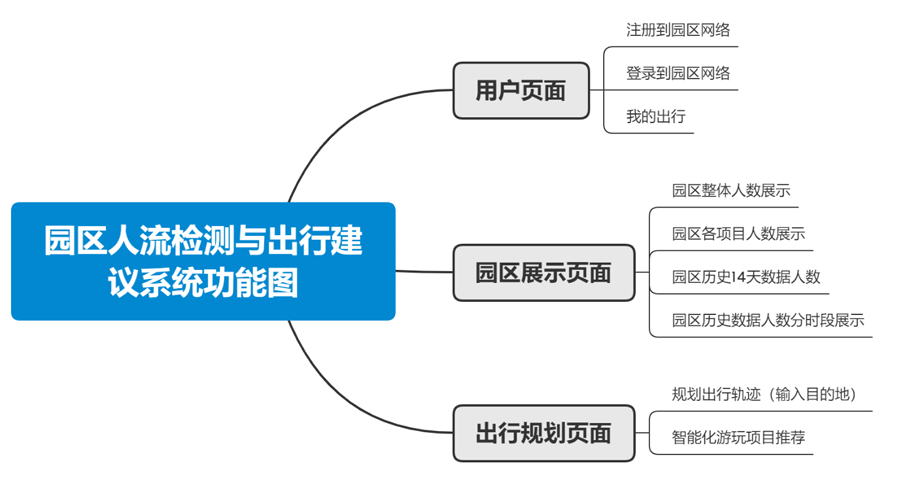

# 基于华为乾坤云平台的游乐场园区智能出行系统
2022 中国高校计算机大赛-网络技术挑战赛 获华北赛区二等奖

## 简介

本项目主要基于华为设备的位置服务功能，而位置服务主要应用于大型商 场，酒店，机场、游乐场、主题公园等场景，满足客户和Wi-Fi用户对于位置服 务的需求。本方案中在游乐场中部署华为AP，并使用华为云平台运维管理，使 用华为云平台提供的位置服务类 API，云平台将 AP 采集到的 WIFI 终端位置 (AP+terminalMac+RSSI+timestamp)经云平台汇总后上传给我们。我们再对数据进 行分析处理后，计算出终端的实时位置，为最终用户提供人流密度，客流分析， 路线规划等位置服务类增值业务。 

 方案最终能够实现的目标是：游乐场园区人流监测、游乐场历史总人数展示 和分时段的人数展示、用户出行路线规划、智能化项目推荐、添加到“我的出行” 进行收藏。

## 技术选型

+ 编程语言： Java 8  
+ 运行环境： Windows10  
+ 后端： SpringBoot 2.7.0 + SpringDataJPA   
+ 数据库：MySQL8.0  
+ 前端：Vue2.0 + Element UI + Apache Echarts + JQuery

## 项目完整功能

